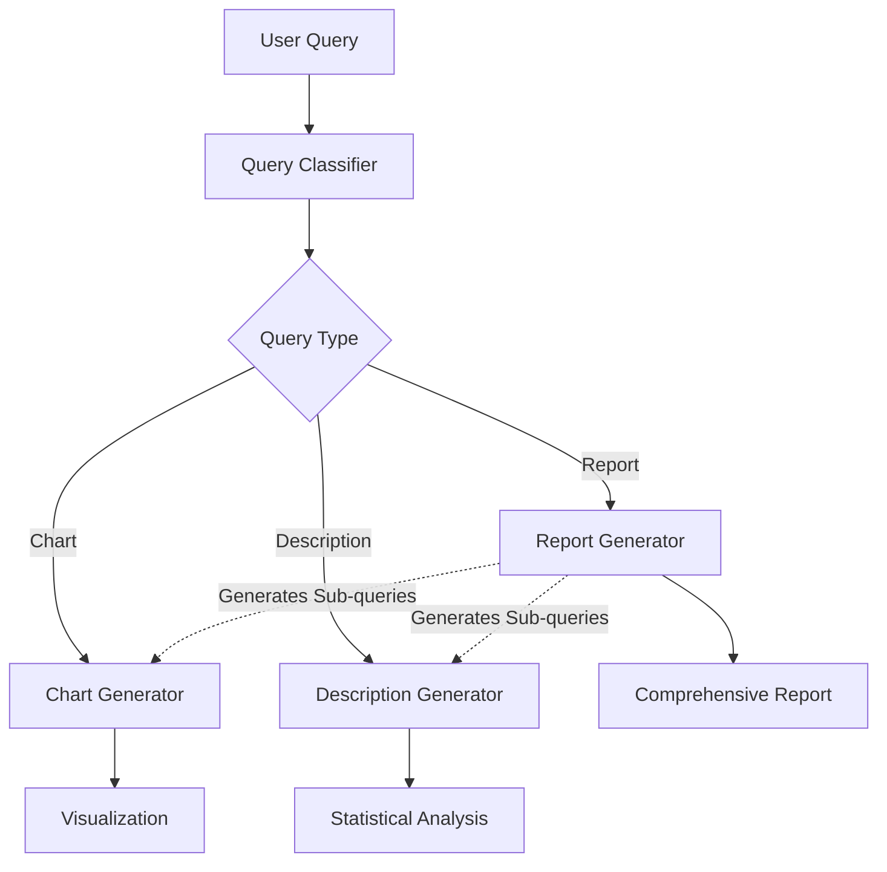
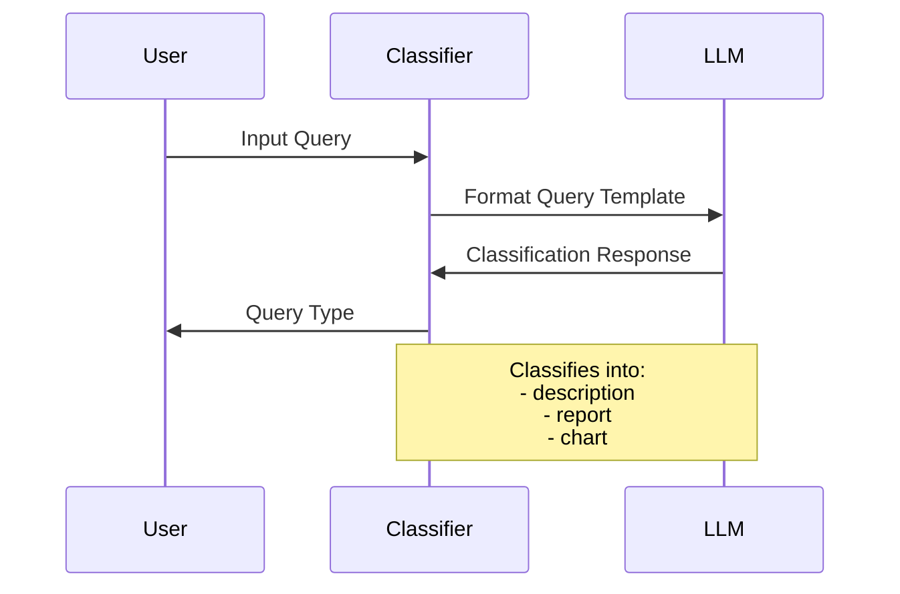
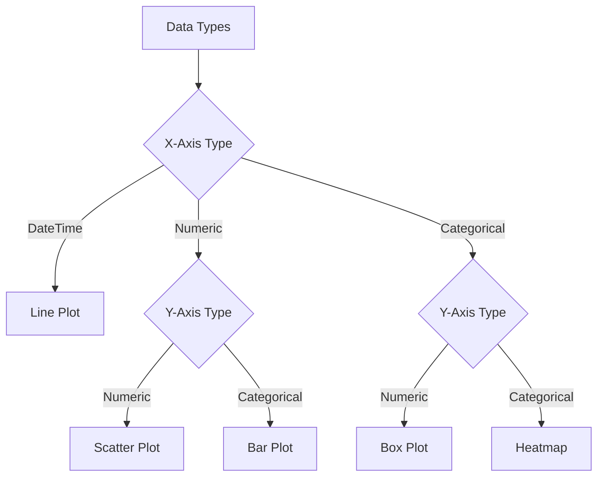
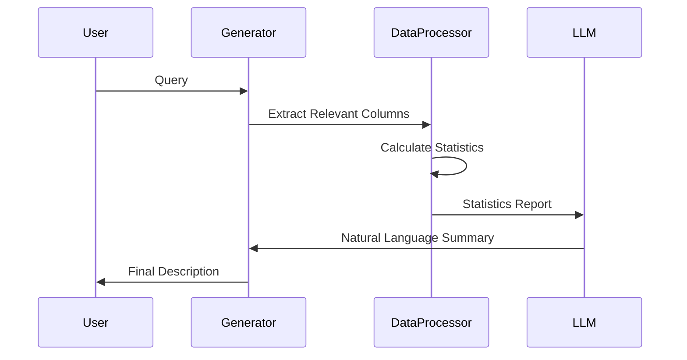
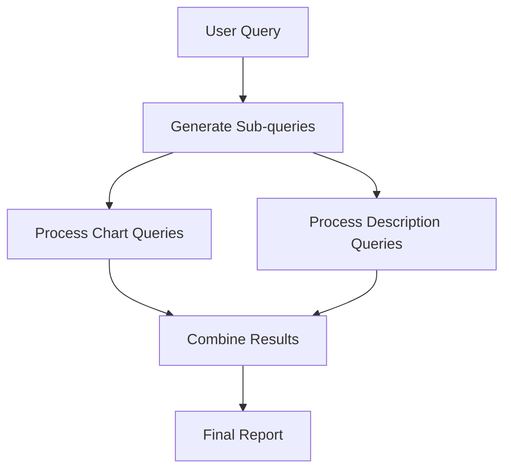

# Data Analysis Query System

A comprehensive data analysis system that processes natural language queries to generate visualizations, descriptions, and reports from JSON data files.

## Overview

This system consists of four main components that work together to analyze data based on natural language queries:

1. **Query Classifier** - Determines the type of analysis needed
2. **Chart Generator** - Creates appropriate visualizations 
3. **Description Generator** - Provides detailed statistical analysis
4. **Report Generator** - Generates comprehensive analytical reports

## System Architecture



## Component Details

### 1. Query Classifier

The query classifier determines the most appropriate type of analysis for a given user query.

#### Flow of Operation:



### 2. Chart Generator

Creates appropriate visualizations based on data types and user requirements.

#### Visualization Selection Logic:



### 3. Description Generator

Provides statistical analysis and natural language descriptions of data patterns.

#### Analysis Process:



### 4. Report Generator

Generates comprehensive reports by combining multiple analyses.

#### Report Generation Flow:



## Usage

0. **Usage:**

Install Conda (if you haven't already)
- Download and install Miniconda or Anaconda from their official website if you haven't already
- Verify installation by running:
   ```conda --version```

Create and activate the environment
- Navigate to the directory containing your environment.yml file
- Create the environment by running:
   ```conda env create -f environment.yml```
- Once created, activate the environment:
   ```conda activate bt4103```

Verify installation
- Check if the environment is properly set up:
   ```conda list```
- Test Python version:
   ```conda version```
    Should show Python 3.12.x

1. **Basic Query:**
```python
from query_classifier import classify_query

query = "Show me the sales trends over time"
query_type = classify_query(query)
```

2. **Generate Chart:**
```python
from chart_generator import process_query

process_query("Plot monthly revenue trends")
```

3. **Get Description:**
```python
from description_generator import process_query

description = process_query("Analyze customer age distribution")
print(description)
```

4. **Generate Report:**
```python
from report_generator import generate_analysis_queries

queries = generate_analysis_queries("Create a comprehensive sales report", json_schemas)
```

## Data Requirements

- Data should be in JSON format
- Files should be stored in the `./Data` directory
- Each JSON file should contain either:
  - A dictionary of data
  - A list of dictionaries with consistent schema

## Dependencies

- Python 3.8+
- pandas
- seaborn
- matplotlib
- langchain
- langchain-ollama
- pydantic

## Error Handling

The system includes comprehensive error handling for:
- Invalid JSON files
- Unsupported data types
- LLM processing errors
- Invalid query formats

## Limitations

- Currently only supports JSON data files
- Requires local Ollama installation with llama3.2 model
- Visualization types are limited to basic chart types
- All data must fit in memory

## Future Improvements

- Support for additional data formats (CSV, SQL, etc.)
- More advanced visualization options
- Batch processing for large datasets
- Integration with more LLM providers
- Interactive visualization capabilities