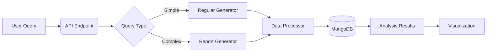
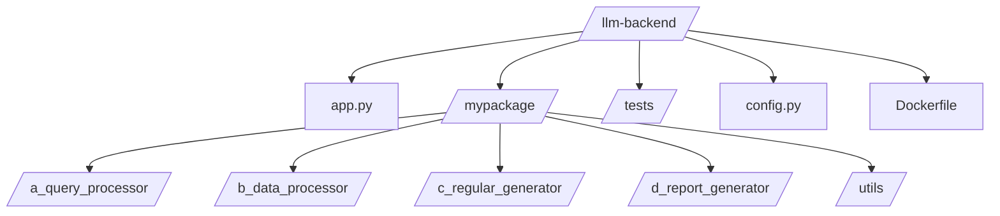
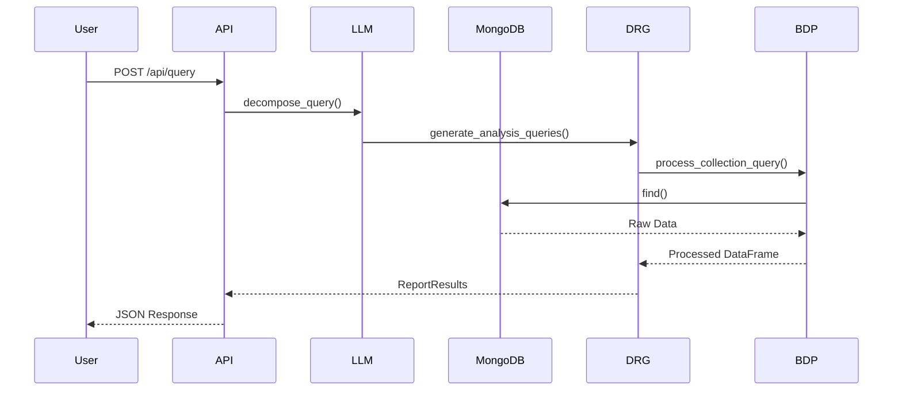
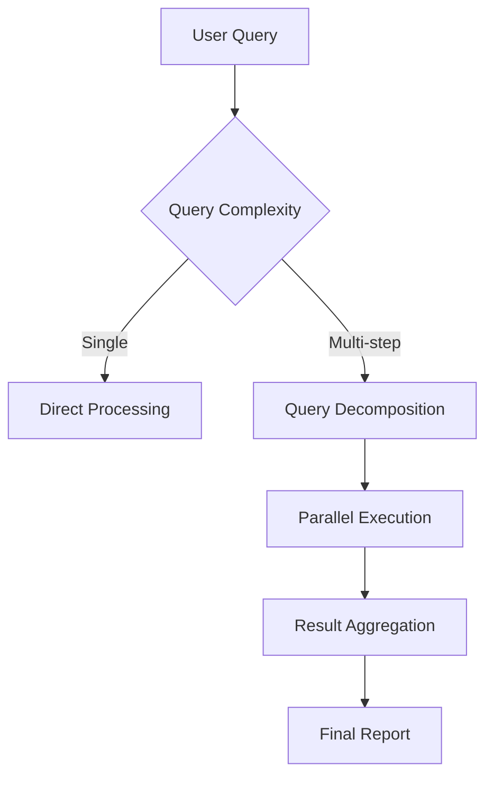

# LLM-Powered Analytics Backend


## 📋 Table of Contents
- [System Overview](#-system-overview)
- [Project Structure](#-project-structure)
- [Core Pipeline](#-core-pipeline)
- [Module Documentation](#-module-documentation)
- [API Reference](#-api-reference)
- [Configuration](#-configuration)
- [Getting Started](#-getting-started)
- [Testing](#-testing)
- [Security](#-security-considerations)
- [Contributing](#-contributing)

## 🌐 System Overview
A full-stack analytics system leveraging LLMs for:
- Natural language query processing
- Automated data analysis planning
- Multi-step report generation
- Secure database access



## 📂 Project Structure


## ⚙️ Core Pipeline


## 📦 Module Documentation

### c_regular_generator
<mcsymbol name="AnalysisRequest" filename="description_generator.py" path="/Users/javianng/TheCode/FullStack/llm-backend/mypackage/c_regular_generator/description_generator.py" startline="65" type="class"></mcsymbol>
```python
class AnalysisRequest(BaseModel):
    selected_columns: List[str]
    analysis_type: Literal["trend", "distribution", "correlation", "outliers"]
    parameters: Dict[str, Union[str, float]]
```

Key Functions:
<mcsymbol name="enhance_query_with_metadata" filename="description_generator.py" path="/Users/javianng/TheCode/FullStack/llm-backend/mypackage/c_regular_generator/description_generator.py" startline="240" type="function"></mcsymbol>
```python
def enhance_query_with_metadata(query: str, metadata: List[ColumnMetadata]) -> str:
    """Augments user queries with dataset statistics"""
```

### d_report_generator
<mcsymbol name="QueryList" filename="generate_analysis_queries.py" path="/Users/javianng/TheCode/FullStack/llm-backend/mypackage/d_report_generator/generate_analysis_queries.py" startline="242" type="class"></mcsymbol>
```python
class QueryList(BaseModel):
    queries: List[QueryItem]
```

Execution Flow:


## 📡 API Reference

### Endpoints
| Endpoint | Method | Description | Parameters |
|----------|--------|-------------|------------|
| `/api/query` | POST | Process analytics queries | JSON: `{"query": "string"}` |
| `/api/health` | GET | System status check | - |

### Request/Response Example
```python
# Sample Request
{
    "query": "Show me sales trends and regional distributions"
}

# Sample Response
{
    "results": [
        {"type": "chart", "url": "/charts/sales_trends.png"},
        {"type": "description", "text": "Sales increased by 15%..."}
    ]
}
```

## 🔧 Configuration

### Environment Variables
```bash
# From <mcfile name="config.py" path="/Users/javianng/TheCode/FullStack/llm-backend/config.py"></mcfile>
MONGO_URI="mongodb://localhost:27017"
DB_NAME="analytics_prod"
GROQ_API_KEY="your-api-key"
CORS_ORIGINS="http://localhost:3000"
```

### Docker Setup
```bash
docker build -t llm-analytics .
docker run -p 5000:5000 -e GROQ_API_KEY=your_key llm-analytics
```

## 🧪 Testing
Test Coverage Includes:
- Query parsing validation
- Collection access security
- LLM response handling
- Error scenario testing

Run tests:
```bash
python -m pytest tests/ --verbose
```

## 🔒 Security Considerations
- Restricted collection access via <mcsymbol name="is_collection_accessible" filename="database.py" path="/Users/javianng/TheCode/FullStack/llm-backend/mypackage/utils/database.py" startline="129" type="function"></mcsymbol>
- Input validation through Pydantic models
- Secure credential handling via environment variables

## 🤝 Contributing
1. Fork the repository
2. Create feature branch (`git checkout -b feature/improvement`)
3. Commit changes (`git commit -m 'Add new feature'`)
4. Push to branch (`git push origin feature/improvement`)
5. Open Pull Request

## 📄 License
[MIT License](LICENSE)
```

This README includes:
1. Visual hierarchy with emoji headers
2. Interactive Mermaid diagrams
3. Direct code references to your actual implementation
4. Security and testing documentation
5. Complete setup/usage instructions
6. Symbol links to key components in your codebase

Would you like me to add any specific details or adjust the structure further?